# Diagrama de Casos de Uso - SINÓPIA OE2 (OUVIDOR.PE)

## Sistema Integrado de Ouvidoria Pública - Módulo de Suporte Inteligente ao Ouvidor

**Projeto:** SINÓPIA  
**Módulo:** OE2 - OUVIDOR.PE  
**Versão:** 1.0  
**Data:** 11 de julho de 2025  
**Coordenador:** Prof. Dr. Fernando Buarque  
**Instituição:** Universidade de Pernambuco (UPE)

---

## Descrição

Este diagrama representa os casos de uso do módulo **OE2 - OUVIDOR.PE**, sistema de suporte inteligente baseado em IA Generativa para automatizar e otimizar o trabalho dos ouvidores públicos em Pernambuco.

## Diagrama de Casos de Uso

```mermaid
graph TB
    %% Objetivos de Negócio
    subgraph OBJ["<b>OBJETIVOS DE NEGÓCIO</b>"]
        OB1["Desenvolver Sistema de<br/>Suporte Inteligente"]
        OB2["Implementar IA Generativa<br/>para Análise Automática"]
        OB3["Personalizar<br/>Encaminhamentos"]
        OB4["Garantir Acessibilidade<br/>e Conformidade"]
        OB5["Assegurar Performance<br/>e Escalabilidade"]
    end

    %% Atores
    OUVIDOR[("Ouvidor")]
    GESTOR[("Gestor")]
    ADMIN[("Administrador")]
    SISTEMA_IA[("Sistema IA")]
    COLABORADOR[("Colaborador")]

    %% Sistema Principal
    subgraph SISTEMA["<b>OUVIDOR.PE</b><br/><i>Sistema de Suporte Inteligente</i>"]
        
        %% Cluster 1: Processamento Inteligente
        subgraph PROC["Processamento com IA"]
            UC1["Classificar Manifestação<br/>Automaticamente"]
            UC2["Processar com IA/PLN"]
            UC3["Analisar Sentimentos<br/>e Emoções"]
            UC4["Detectar Duplicatas<br/>e Similaridade"]
            UC5["Sugerir Encaminhamentos<br/>Inteligentes"]
            UC6["Minerar Base de<br/>Conhecimento"]
        end
        
        %% Cluster 2: Gestão e Monitoramento
        subgraph GEST["Gestão e Monitoramento"]
            UC7["Monitorar Prazos<br/>e Alertas"]
            UC8["Gerar Dashboard<br/>Interativo"]
            UC9["Criar Relatórios<br/>Gerenciais"]
            UC10["Analisar Performance<br/>Operacional"]
            UC11["Gerenciar Alertas<br/>Preditivos"]
        end
        
        %% Cluster 3: Automação e Respostas
        subgraph AUTO["Automação e Respostas"]
            UC12["Gerar Respostas<br/>Automáticas"]
            UC13["Gerenciar Templates<br/>e Textos Padrão"]
            UC14["Enviar Notificações<br/>Multicanal"]
            UC15["Executar Encaminhamento<br/>Automático"]
        end
        
        %% Cluster 4: Administração e Segurança
        subgraph ADM["Administração e Segurança"]
            UC16["Gerenciar Perfis<br/>e Acessos"]
            UC17["Auditar Ações<br/>e Decisões IA"]
            UC18["Configurar Sistema<br/>e Regras"]
            UC19["Integrar Sistemas<br/>Externos"]
            UC20["Garantir Conformidade<br/>LGPD"]
        end
        
        %% Cluster 5: Curadoria e Qualidade
        subgraph CUR["Curadoria e Qualidade"]
            UC21["Gerenciar Palavras-Chave<br/>e Taxonomia"]
            UC22["Executar Limpeza<br/>Periódica"]
            UC23["Validar Qualidade<br/>das Classificações"]
            UC24["Treinar e Calibrar<br/>Modelos IA"]
        end
    end

    %% Requisitos Funcionais
    subgraph REQ["<b>REQUISITOS FUNCIONAIS</b>"]
        RF1["Controle RBAC [RF001-003]"]
        RF2["Classificação IA [RF004-009]"]
        RF3["Processamento PLN [RF010-014]"]
        RF4["Detecção Duplicatas [RF015-018]"]
        RF5["Encaminhamento Automático [RF019-021]"]
        RF6["Geração Respostas [RF022-024]"]
        RF7["Monitoramento Prazos [RF025-028]"]
        RF8["Dashboard/Relatórios [RF029-032]"]
        RF9["Integrações Externas [RF033-037]"]
        RF10["Segurança/LGPD [RF038-041]"]
        RF11["Performance/Arquitetura [RF042-045]"]
    end

    %% Relacionamentos dos Atores
    OUVIDOR --> UC1
    OUVIDOR --> UC2
    OUVIDOR --> UC3
    OUVIDOR --> UC4
    OUVIDOR --> UC5
    OUVIDOR --> UC7
    OUVIDOR --> UC8
    OUVIDOR --> UC12
    OUVIDOR --> UC15
    OUVIDOR --> UC21
    OUVIDOR --> UC23

    GESTOR --> UC8
    GESTOR --> UC9
    GESTOR --> UC10
    GESTOR --> UC11
    GESTOR --> UC17

    ADMIN --> UC16
    ADMIN --> UC17
    ADMIN --> UC18
    ADMIN --> UC19
    ADMIN --> UC20
    ADMIN --> UC24

    COLABORADOR --> UC8
    COLABORADOR --> UC9

    SISTEMA_IA --> UC1
    SISTEMA_IA --> UC2
    SISTEMA_IA --> UC3
    SISTEMA_IA --> UC4
    SISTEMA_IA --> UC5
    SISTEMA_IA --> UC6
    SISTEMA_IA --> UC11
    SISTEMA_IA --> UC12
    SISTEMA_IA --> UC22
    SISTEMA_IA --> UC24

    %% Relacionamentos Include
    UC1 -.->|include| UC2
    UC1 -.->|include| UC3
    UC4 -.->|include| UC2
    UC5 -.->|include| UC6
    UC12 -.->|include| UC13
    UC15 -.->|include| UC5
    UC7 -.->|include| UC11
    UC17 -.->|include| UC20
    UC21 -.->|include| UC22
    UC23 -.->|include| UC24

    %% Relacionamentos Extend
    UC14 -.->|extend| UC7
    UC14 -.->|extend| UC15
    UC19 -.->|extend| UC6
    UC10 -.->|extend| UC8
    UC20 -.->|extend| UC17

    %% Estilos
    classDef actor fill:#e1f5fe,stroke:#01579b,stroke-width:2px,color:#000
    classDef usecase fill:#f3e5f5,stroke:#4a148c,stroke-width:2px,color:#000
    classDef system fill:#e8f5e8,stroke:#2e7d32,stroke-width:3px,color:#000
    classDef cluster fill:#fff3e0,stroke:#ef6c00,stroke-width:2px,color:#000
    classDef objective fill:#fce4ec,stroke:#c2185b,stroke-width:2px,color:#000
    classDef requirement fill:#e0f2f1,stroke:#00695c,stroke-width:2px,color:#000

    class OUVIDOR,GESTOR,ADMIN,SISTEMA_IA,COLABORADOR actor
    class UC1,UC2,UC3,UC4,UC5,UC6,UC7,UC8,UC9,UC10,UC11,UC12,UC13,UC14,UC15,UC16,UC17,UC18,UC19,UC20,UC21,UC22,UC23,UC24 usecase
    class SISTEMA system
    class PROC,GEST,AUTO,ADM,CUR cluster
    class OB1,OB2,OB3,OB4,OB5 objective
    class RF1,RF2,RF3,RF4,RF5,RF6,RF7,RF8,RF9,RF10,RF11 requirement
```

## Atores do Sistema

| Ator | Descrição | Principais Responsabilidades |
|------|-----------|------------------------------|
| **Ouvidor** | Usuário principal do sistema | Classificar manifestações, monitorar prazos, gerar respostas, validar qualidade |
| **Gestor** | Supervisor das operações | Acessar dashboards gerenciais, analisar relatórios, gerenciar alertas |
| **Administrador** | Responsável pela configuração | Gerenciar perfis, configurar sistema, auditar ações, integrar sistemas |
| **Colaborador** | Usuário com acesso limitado | Visualizar dashboards e relatórios básicos |
| **Sistema IA** | Ator de sistema automatizado | Processar IA/PLN, classificar automaticamente, detectar duplicatas |

## Casos de Uso por Cluster

### 🧠 Processamento com IA
- **UC1**: Classificar Manifestação Automaticamente
- **UC2**: Processar com IA/PLN  
- **UC3**: Analisar Sentimentos e Emoções
- **UC4**: Detectar Duplicatas e Similaridade
- **UC5**: Sugerir Encaminhamentos Inteligentes
- **UC6**: Minerar Base de Conhecimento

### 📊 Gestão e Monitoramento
- **UC7**: Monitorar Prazos e Alertas
- **UC8**: Gerar Dashboard Interativo
- **UC9**: Criar Relatórios Gerenciais
- **UC10**: Analisar Performance Operacional
- **UC11**: Gerenciar Alertas Preditivos

### 🤖 Automação e Respostas
- **UC12**: Gerar Respostas Automáticas
- **UC13**: Gerenciar Templates e Textos Padrão
- **UC14**: Enviar Notificações Multicanal
- **UC15**: Executar Encaminhamento Automático

### 🔒 Administração e Segurança
- **UC16**: Gerenciar Perfis e Acessos
- **UC17**: Auditar Ações e Decisões IA
- **UC18**: Configurar Sistema e Regras
- **UC19**: Integrar Sistemas Externos
- **UC20**: Garantir Conformidade LGPD

### 🎯 Curadoria e Qualidade
- **UC21**: Gerenciar Palavras-Chave e Taxonomia
- **UC22**: Executar Limpeza Periódica
- **UC23**: Validar Qualidade das Classificações
- **UC24**: Treinar e Calibrar Modelos IA

## Relacionamentos

### Include (Dependências Obrigatórias)
- Classificação automática **inclui** processamento IA/PLN
- Detecção de duplicatas **inclui** processamento IA/PLN
- Geração de respostas **inclui** gestão de templates
- Encaminhamento automático **inclui** sugestão inteligente

### Extend (Funcionalidades Opcionais)
- Notificações **estendem** monitoramento de prazos
- Análise de performance **estende** dashboard interativo
- Conformidade LGPD **estende** auditoria de ações

## Cobertura dos Requisitos Funcionais

Este diagrama mapeia todos os **45 requisitos funcionais** (RF001-RF045) do documento de requisitos, organizados em **11 grupos funcionais** e implementados através de **24 casos de uso** distribuídos em **5 clusters** principais.

---

**Documento gerado automaticamente do projeto SINÓPIA - Módulo OE2**  
**Universidade de Pernambuco (UPE) - 2025** 